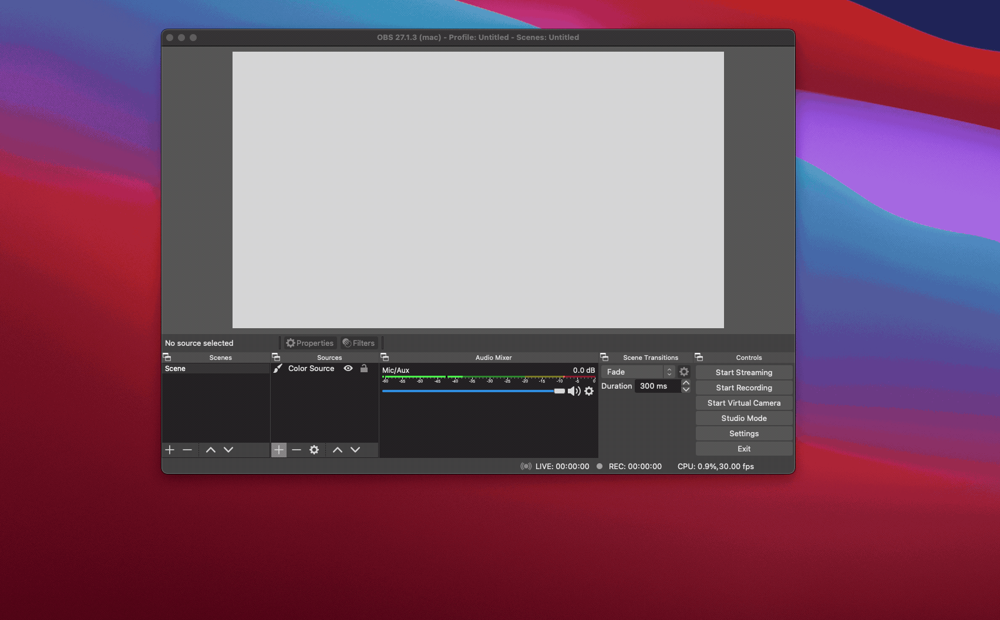

Hello world, simple readme.

## Starting the environment

I set up the app using python3 (3.8.6).
There is a virtual environment set up for the app to lock a certain python version, as well as setting up dependencies.

Activate the virtual environment by running:

```
source timerapp/bin/activate

# If on windows you can run:
timerapp\Scripts\activate
```

Install any added libraries by running:
```
pip install -r requirements.txt
```

note: if any new requirements are added, they need to be "frozen" into the requirements file using:
```
pip freeze > requirements.txt
```

To start the app locally run:
```
python app.py
```

This will start the app on 51023, you can visit it at <a href="localhost:51023">localhost:51023</a>.

## General Design

### OAuth 2 Workflow

This is going to be a workflow we need to build into the app with proper web pages.
This is what gets us an access_token to subscribe to QT's stream of updates on the socket api (https://dev.streamlabs.com/docs/socket-api).

My proposal is to add a list of sub-endpoints like:
```
localhost:51023/auth/login     # this is the base for our page, will direct users to the SL endpoint
                               # through some mechanism tbd (js or 302, not sure)

localhost:51023/auth/callback  # Endpoint SL will redirect users to, this is how we get the access + refresh tokens
```

We will need to store the data.
To start we can maybe just use local variables - but they will not be durable if we restart the app in the cloud.
Eventually, I think we can cache them in a database.

Sign in flow for our app:
- User visits `/auth/login` and enters a random ID (We can generate a UUID for them)
    - this id will be what is used to identify them and the key to access/refresh tokens in the database
- User is sent to StreamLabs to approve our app to have access to them

- User uses their secret token to access an admin endpoint `/admin` - they enter their token in the page so that it is not stored in URL history
    - this page lets them control the timer/config settings
    - this is not needed for MVP, we can work with QT to set default config for lego stream and update on the fly as needed (e.g. 15 minute timer on reset and +/- 30 seconds per donation)
- User can enter the url `localhost:51023/obsplugin/{token}` in their OBS web browser plugin
    - this is the read only page with the countdown

Eventually we probably need some proper login, maybe we can use twitch auth for them to sign in.
Not too worried about it for the time being since it should be short lived.

### Streaming events to the plugin

I think we can support getting events to the plugin (i.e. the browser) by holding onto events in memory on our server - and then passing them off to the browser when it requests them.
The browser will poll on some cadence to get the latest events - and apply any deltas using javascript.

The server will need to make sure that we have an ongoing websocket connection to streamlabs to make sure we don't lose events.
If there are problems with connectivity, we may need to implement some way of using other endpoints go get data as well.

1. flask app connects to socket api and begins receiving events from Stream Labs
    - Events are saved locally in a list
1. browser app pings a GET endpoint asking for the latest events
1. Flask app responds with all events that have happened
    - After events are streamed back, they are removed from the list
1. The client updates its UI in response to the events it received, and schedules another fetch in 5 seconds
1. New events that the server receives are stored in the list again to repeat the process

We can also enhance this using a websocket between the client + cloud.
That would allow events to be immediately streamed, with no delay.
For now, I don't think that is needed, it can be added later on if we need it.

## Helpful guides/documents:
### Setting OAuth 2 with StreamLabs
https://dev.streamlabs.com/docs/connecting-to-an-account

### StreamLabs Socket API
https://dev.streamlabs.com/docs/socket-api

### Setting up http files with Flask
https://www.digitalocean.com/community/tutorials/how-to-make-a-web-application-using-flask-in-python-3

This will be helpful for building pages in the above flow.


## Setting up OBS

To set up OBS, we are just going to add a new source.
Ensure the python app is running then do the following:
- Add a new source > Browser
- Name the source whatever you want
- In the URL enter `http://localhost:51023`
  - Once the app is deployed to the cloud, this will be the real URL. Users should enter the url `/obsplugin/{token}`




## SSH to the server

There's an EC2 instance running. The private IP is at 172.31.92.224, will need a key set up to access it.

```
ssh ubuntu@100.26.97.247
```

The project is setup to run in tmux using the key `ttv-timer-app`

### Attach to the session:

```
tmux a -t ttv-timer-app
```

### Detach from the session
This will leave the session running in the background
```
ctrl + b  >  d
```

### Starting a new version of the app
Because there is no persistent storage, I am just starting the app from scratch every time.
Ensure any sessions running it are stopped!

Clone the repo (TODO: add an ssh key to my github to just pull the latest veresion).

```
cd git-repos
rm -rf ttv-race-the-timer
git clone https://github.com/garrison-stauffer/ttv-race-the-timer.git
```

Set up a virtual environment and download requirements
```
python3 -m venv timerapp
source timerapp/bin/activate

pip install -r requirements.txt
```

Start the app on a desired port
```
flask run --host=0.0.0.0 --port=51023
```
